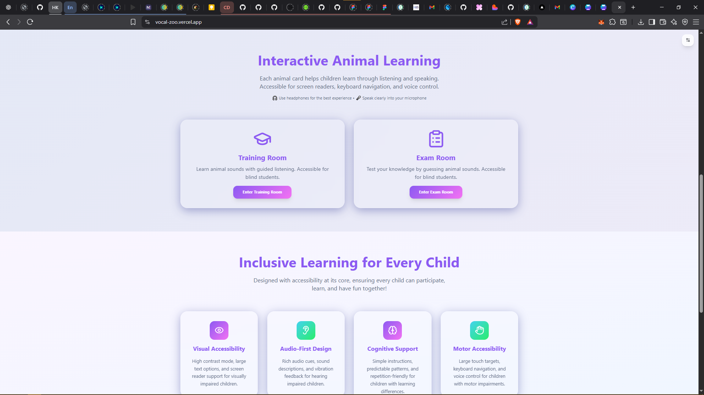

# 🦁 Vocal Zoo

**An inclusive, audio-first adventure for ALL children to learn and play together!**

[](https://vitejs.dev/) [](https://www.typescriptlang.org/) [](https://tailwindcss.com/) [](#accessibility)

---

## 🚀 Live Demo

Visit the app live at: [vocal-zoo.vercel.app](https://vocal-zoo.vercel.app)

---

## 🎬 Demo Video

[](https://drive.google.com/file/d/1KGaoE80rC42B2TVyAgFIVLvbMrlHBVrb/view?usp=sharing)

---

## 🌟 What is Vocal Zoo?

Vocal Zoo is a playful, accessible web app where children of all abilities can learn animal sounds, test their knowledge, and have fun—together! Designed with **universal accessibility** in mind, it features:

- **Visual Accessibility:** High contrast, large text, and screen reader support
- **Audio-First Design:** Rich sound cues, descriptions, and vibration feedback
- **Cognitive Support:** Simple instructions, repetition, and predictable patterns
- **Motor Accessibility:** Large touch targets, keyboard navigation, and voice control

---

## 🖼️ Screenshots

### Homepage


### Choose Training or Exam


### Animal Training Room


### Animal Training Room (Slideshow)


### Animal Exam Room


### Animal Exam Room (Slideshow)


---

## 🚀 Features

- **Interactive Animal Learning:**
  - Training Room: Learn animal sounds with guided listening
  - Exam Room: Test your knowledge by guessing animal sounds
- **Accessibility Controls:**
  - Toggle high contrast, large text, and sound modes
- **Fun, Glassy Design:**
  - Playful UI, animated emojis, and vibrant gradients
- **No Download Required:**
  - 100% web-based, safe for kids, and privacy-friendly

---

## 🛠️ Tech Stack

- [Vite](https://vitejs.dev/) + [React](https://react.dev/) + [TypeScript](https://www.typescriptlang.org/)
- [Tailwind CSS](https://tailwindcss.com/) + [shadcn/ui](https://ui.shadcn.com/)
- [React Router](https://reactrouter.com/)

---

## 🧑‍💻 Getting Started

**GitHub Repository:** [https://github.com/Abelboby/VocalZoo](https://github.com/Abelboby/VocalZoo)

1. **Clone the repository:**
   ```sh
   git clone https://github.com/Abelboby/VocalZoo.git
   cd VocalZoo
   ```
2. **Install dependencies:**
   ```sh
   npm install
   ```
3. **Run the development server:**
   ```sh
   npm run dev
   ```
4. **Open in your browser:**
   Visit [http://localhost:5173](http://localhost:5173)

---

## 👥 Contributors

- [Abel Boby](https://github.com/Abelboby)
- [Parthav Povil](https://github.com/parthavpovil)
- [Adwaith Jayasankar](https://github.com/kichuman28)
- [Haris Peter](https://github.com/haris-peter)

---

## ♿ Accessibility

Vocal Zoo is built for **ALL** children:
- Screen reader friendly
- Keyboard and voice navigation
- High contrast and large text modes
- Simple, predictable, and fun for everyone

---

## 📢 Contributing

We welcome contributions that make Vocal Zoo even more fun and accessible! Please open issues or pull requests.

---

## 📄 License

MIT License. See [LICENSE](LICENSE) for details.
